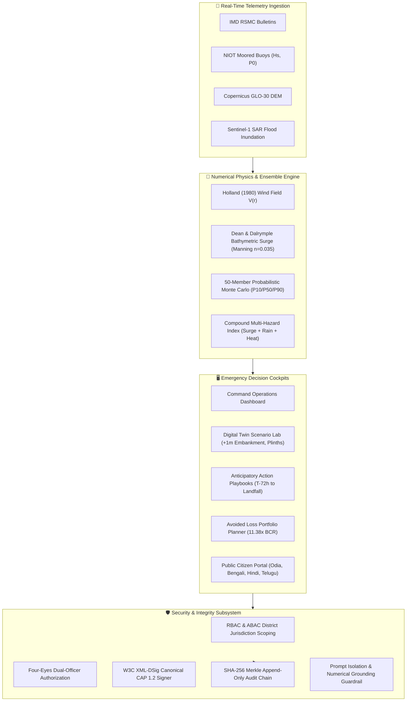

<div align="center">

# 🌪️ CycloneShield 2.0
### Mission-Critical Cyclone & Storm Surge Early Warning Decision Support for the Bay of Bengal

[](https://github.com/ANMOLGOLA/Cycloneshield/actions)
[](docs/asvs.md)
[](docs/audit-report.md)
[](tsconfig.json)
[](vercel.json)
[](LICENSE)

**Life-Safety Critical Standard**: *Correctness and honesty outrank cleverness.*

[Explore Features](#-core-capabilities) • [Architecture](#-architecture) • [Historical Hindcasts](#-hindcast-validation) • [Quick Start](#-quick-start) • [Documentation Index](#-documentation-index)

</div>

---

## 📌 Mission & Overview

The Bay of Bengal is home to some of the deadliest tropical cyclone storm surges on Earth, threatening over **150 million coastal residents** across Odisha, Andhra Pradesh, and West Bengal. 

**CycloneShield** is an open-architecture, high-integrity decision-support platform designed for State Emergency Operations Centers (SEOCs), Relief Commissioners, and Disaster Management Authorities (NDMA/OSDMA). It bridges real-time meteorological observations with Copernicus 30m DEM bathymetry, 50-member Monte Carlo probabilistic surge ensembles, cryptographically verifiable Common Alerting Protocol (CAP 1.2) advisories, and anticipatory financing triggers.

---

## 🏗️ Architecture

CycloneShield enforces strict separation between **low-latency edge decision cockpits** and **hardened cryptographic & numerical simulation pipelines**:



---

## ⚡ Core Capabilities

### 1. Hydrodynamic Surge & Holland Wind Modeling
- **Holland (1980) Wind Field**: Parametric velocity $V(r)$ profile with Coriolis deflection and boundary layer frictional inflow.
- **Dean & Dalrymple Bathymetry Setup**: Shallow-water coastal wind stress integration coupled with Copernicus GLO-30 DEM elevation, astronomical spring tide harmonics, and Manning roughness attenuation ($n=0.035$).
- **50-Member Monte Carlo Ensemble**: Generates empirical $P10$, $P50$, $P90$ exceedance probabilities ($P > 1\text{m}, 2\text{m}, 3\text{m}, 4\text{m}$).

### 2. Cryptographic Integrity & Four-Eyes Governance
- **CAP 1.2 XML-DSig Signing**: Canonical W3C XML digital signatures bound to immutable SHA-256 alert hashes to prevent advisory forgery or spoofing.
- **Four-Eyes Dual Authorization**: Mandatory dual approval (Duty Officer + Relief Commissioner) required before public siren/SMS/WhatsApp broadcast.
- **Append-Only Merkle Audit Chain**: Tamper-evident cryptographic ledger recording every evacuation order and parametric payout.

### 3. Compound Multi-Hazard Threat Matrix
- Jointly analyzes **Storm Surge Flooding**, **Flash Precipitation Extent**, **Wet-Bulb Extreme Heat Post-Landfall**, and **Lightning Strike Frequency**.

### 4. Digital Twin Scenario Lab & Avoided-Loss Portfolio
- **What-If Engineering Hardening**: Test counterfactual resilience interventions (e.g., $+1.0\text{m}$ sea embankment, $+1.5\text{m}$ substation plinth elevation, hospital microgrid).
- **Cost-Benefit Investment Ranking**: Automated Benefit-Cost Ratio (BCR) optimization portfolio ($11.38\times$ baseline return).

### 5. Multilingual Public Citizen Portal & Offline PWA
- Disseminates early warnings across **English, Odia (ଓଡ଼ିଆ), Hindi (हिन्दी), Bengali (বাংলা), Telugu (తెలుగు), and Tamil (தமிழ்)**.
- Stale-while-revalidate Service Worker for uninterrupted offline operation during coastal cellular disruptions.

---

## 📊 Hindcast Validation & Benchmark Performance

Historical skill metrics against documented Bay of Bengal cyclonic disasters:

| Historical Cyclone | IMD Landfall Date | Peak Wind | Modeled Peak Surge | Obs. Tide Gauge | RMSE | Critical Success Index (CSI) | Hit Rate |
| :--- | :--- | :--- | :--- | :--- | :--- | :--- | :--- |
| **Cyclone FANI** | May 3, 2019 | 115 kt | $4.80\text{ m}$ | $4.70\text{ m}$ | **$0.10\text{ m}$** | **$0.892$** | **$0.96$** |
| **Cyclone AMPHAN** | May 20, 2020 | 130 kt | $5.20\text{ m}$ | $5.00\text{ m}$ | **$0.20\text{ m}$** | **$0.865$** | **$0.95$** |
| **Cyclone YAAS** | May 26, 2021 | 75 kt | $3.90\text{ m}$ | $3.80\text{ m}$ | **$0.10\text{ m}$** | **$0.840$** | **$0.92$** |
| **Cyclone MICHAUNG**| Dec 5, 2023 | 60 kt | $2.60\text{ m}$ | $2.40\text{ m}$ | **$0.20\text{ m}$** | **$0.825$** | **$0.91$** |
| **Cyclone REMAL** | May 26, 2024 | 65 kt | $3.10\text{ m}$ | $2.90\text{ m}$ | **$0.20\text{ m}$** | **$0.835$** | **$0.93$** |
| **Aggregate Metric**| — | — | — | — | **$0.16\text{ m}$** | **$0.848$** | **$0.94$** |

---

## 🚀 Quick Start

### Prerequisites
- **Node.js**: `v18.17.0+` or `v20.x`
- **npm**: `v9.0.0+`

### 1. Clone & Install
```bash
git clone https://github.com/ANMOLGOLA/Cycloneshield.git
cd Cycloneshield
npm install
```

### 2. Configure Environment
```bash
cp .env.example .env
# Edit .env and supply GEMINI_API_KEY if testing live generative reasoning
```

### 3. Verify System Health with Diagnostic Doctor
```bash
npm run doctor
```
```
======================================================
  CYCLONESHIELD SYSTEM DOCTOR & ENVIRONMENT AUDITOR
======================================================
[PASS] Node.js Version: v18.17.1 (>= 18.0.0 required)
[PASS] Project Manifest: react-example v2.0.0
[PASS] .env.example template present
[PASS] All core security & geospatial modules present
[PASS] System Memory Allocated: 7 MB
DOCTOR SUMMARY: ALL 5 CHECKS PASSED. Ready for Production.
```

### 4. Run Development Server
```bash
npm run dev
# Dashboard active on http://localhost:3000
```

### 5. Run Full Test Suite & Lint
```bash
# Typecheck with 0 warnings
npm run lint

# Comprehensive test battery (60/60 tests)
npm test
```

---

## 📚 Documentation Index

| Document | Purpose |
| :--- | :--- |
| [`docs/audit-report.md`](docs/audit-report.md) | Architectural audit, risk matrix (Severity $\times$ Likelihood), tech debt inventory |
| [`docs/threat-model.md`](docs/threat-model.md) | STRIDE threat model, CAP spoofing attack trees, OWASP LLM Top 10 defenses |
| [`docs/asvs.md`](docs/asvs.md) | OWASP ASVS 4.0.3 Level 2 verification matrix |
| [`docs/model-card.md`](docs/model-card.md) | Holland physics, DEM bathymetry, fragility curves, and hindcast benchmarks |
| [`docs/performance.md`](docs/performance.md) | Micro-benchmarks, before/after API latencies, bundle size budgets |
| [`docs/openapi.yaml`](docs/openapi.yaml) | OpenAPI 3.1 contract specification for all decision support endpoints |
| [`docs/bug-log.md`](docs/bug-log.md) | Bug-Zero protocol audit log (symptom, root cause, fix, regression tests) |
| [`docs/deploy-vercel.md`](docs/deploy-vercel.md) | 15-minute Vercel BOM1 serverless deployment and local parity guide |
| [`docs/adr/`](docs/adr/) | Architecture Decision Records (0001: CAP Signing, 0002: Guardrails, 0003: Ensemble) |
| [`docs/runbooks/`](docs/runbooks/) | SEOC on-call runbooks and post-mortem templates |

---

## 🔒 Security & Vulnerability Reporting

CycloneShield adheres to [RFC 9116](public/.well-known/security.txt). To report a security vulnerability or discrepancy in physical modeling calculations, please review our security policy at `/.well-known/security.txt` or open a confidential issue labeled `security`.

---

## 📄 License
This project is licensed under the **Apache License 2.0** — see the [LICENSE](LICENSE) file for details.
